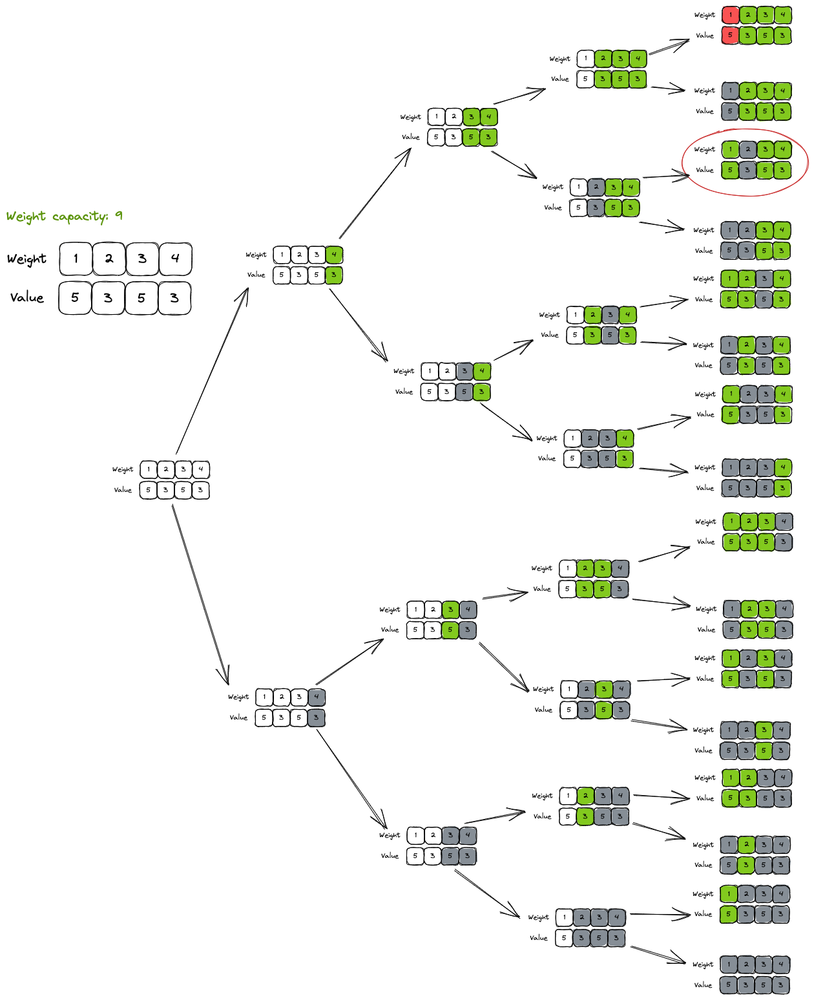
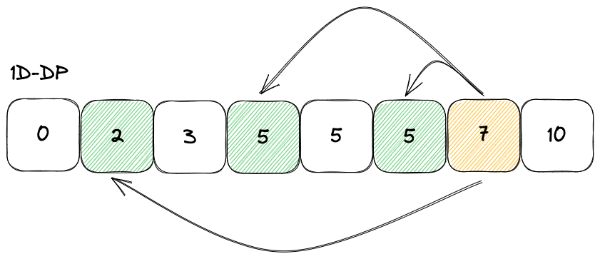
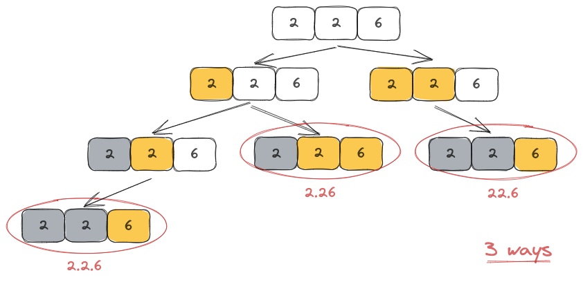

# Dynamic Programming

### Todo

* [ ] [Minimum Cost to Cut a Stick](https://leetcode.com/problems/minimum-cost-to-cut-a-stick)
* [ ] [Delete Operation for Two Strings](https://leetcode.com/problems/delete-operation-for-two-strings)
* [ ] Bottom-up for [Minimum Cost For Tickets](https://leetcode.com/problems/minimum-cost-for-tickets)

### Methodology for Solving DPs

#### 1. Identify the category

1. [0/1 Knapsack](dp.md#1.-0-1-knapsack)
2. [Unbounded Knapsack](dp.md#unbounded-knapsack)
3. Shortest Path (eg: Unique Paths I/II) - or is it Palindromic Sequence as seen on educative.io?
4. [Fibonacci Numbers](dp.md#fibonacci-numbers) (eg: House Thief, Jump Game)
5. [Longest Common Substring](dp.md#longest-common-substring)

#### 2. States

The variables you need to keep track of in order to reach the optimal result.


If recursion within a separate function is used, these state variables are the ones typically passed into the function as parameters.


* 0/1 Knapsack: In general, you'll require two states - _index_ (usually indicating your current position within the given array) and _current value_.
* Unbounded knapsack:
* Palindromic sequence:
* Fibonacci sequence:
* Longest common substring/sequence:

#### 3. Decisions

The step that brings you closer to the base case. In a 0/1 Knapsack problem, it is deciding whether or not to include the current item in the knapsack.

```python
def dp(i, val, items):
    # ...
    
    noIncl = dp(i + 1, val, items)
    incl = dp(i + 1, val + items[i], items)
    
    return max(incl, noIncl)
```

#### 4. Base case

The base case relates directly to the conditions required by the answer. Identify the valid and invalid base cases.

It can be, e.g.:

* Index being out of bounds
* Capacity limit reached

An example of a valid base case can be: index is out of bounds, but current value is still within the capacity limit.

An example of an invalid base case can be: current value is outside of the capacity limit.

#### 5. \[After coding] Optimize

If you've used a top-down recursive method, you could use an array for memoization:

```python
class Solution:
    def findTargetSumWays(self, nums, S):
        index = len(nums) - 1
        curr_sum = 0
        self.memo = {} # array to memoize
        return self.dp(nums, S, index, curr_sum)
        
    def dp(self, nums, target, index, curr_sum):
        if (index, curr_sum) in self.memo:
            return self.memo[(index, curr_sum)]
        
        if index < 0 and curr_sum == target:
            return 1
        if index < 0:
            return 0 
        
        positive = self.dp(nums, target, index-1, curr_sum + nums[index])
        negative = self.dp(nums, target, index-1, curr_sum + -nums[index])
        
        self.memo[(index, curr_sum)] = positive + negative
        return self.memo[(index, curr_sum)]
```

### Patterns

#### 1. 0/1 Knapsack

Given an array of items which each have a _weight (w)_ and _value (v)_ assigned, and a _capacity (c)_ that specifies the total value of items you can put within a knapsack, find the **maximum value** you can store within it.


<figure><figcaption></figcaption></figure>

Examples

* [Equal Subset Sum Partition](https://leetcode.com/problems/partition-equal-subset-sum/)
* Subset Sum
* Minimum Subset Sum Difference
* Count of Subset Sum
* Target Sum

#### Unbounded Knapsack

Same as 0/1 knapsack, except that you can put any number of weights into the knapsack (i.e. not just restricted to one).

<figure><figcaption></figcaption></figure>

Examples

* Rod Cutting
* [Coin Change](https://leetcode.com/problems/coin-change/)
* [Coin Change II](https://leetcode.com/problems/coin-change-ii/)
* Minimum Coin Change
* Maximum Ribbon Cut
* [Minimum Cost for Tickets](https://leetcode.com/problems/minimum-cost-for-tickets/)

#### Fibonacci Numbers

Examples

* Staircase
* Number factors
* Minimum jumps to reach the end
* Minimum jumps with fee
* House thief
* [Maximum Alternating Subsequence Sum](https://leetcode.com/problems/maximum-alternating-subsequence-sum/) (also falls under the [Longest Common Substring](dp.md#longest-common-substring) category)

#### Palindromic Sequence

Examples

* Longest Palindromic Subsequence (also falls in the [Longest Common Substring](dp.md#longest-common-substring) category)
* Longest Palindromic Substring
* Count of Palindromic Substrings
* Minimum Deletions in a String to make it a Palindrome
* Palindromic Partitioning

#### Longest Common Substring

Examples

* Longest Common Substring
* Longest Common Subsequence
* Minimum Deletions and Insertions to Transform a String into Another
* Longest Increasing Subsequence ([solution](dp.md#longest-increasing-subsequence))
* Maximum Sum Increasing Subsequence
* Shortest Common Super-Sequence
* Minimum Deletions to Make a Sequence Sorted
* Longest Repeating Subsequence
* Subsequence Pattern Matching
* Longest Bitonic Subsequence
* Longest Alternating Subsequence
* [Distinct Subsequences](https://leetcode.com/problems/distinct-subsequences/)
* [Edit Distance](https://leetcode.com/problems/edit-distance/)
* Strings Interleaving

### Problems

#### [Decode Ways](https://leetcode.com/problems/decode-ways/)


recursion, 0/1 knapsack


Using a recursive function (let's call it _**r**_), imagine trying to maximize the number of times _**r**_ is called as long as it's valid. This enables all pathways of these calls to hit the base case of `return 1`, so they eventually all add up to the total number of ways this number pattern can be decoded.

(Imagine scattering out all your Pokeballs in the hopes of each Pokeball thrown out captures 1 Pokemon each.)&#x20;

<figure><figcaption></figcaption></figure>

```python
from functools import lru_cache

class Solution:
    def numDecodings(self, s: str) -> int:
        n = len(s)

        @lru_cache(None)
        def dp(i: int) -> int:
            if i == n: return 1
            
            num = 0
            if s[i] != "0":
                num += dp(i + 1)
            if i + 1 < n and 10 <= int(s[i:i + 2]) <= 26:
                num += dp(i + 2)

            return num

        return dp(0)
```

#### [Longest Common Subsequence](https://leetcode.com/problems/longest-common-subsequence/)


"Longest Common Substring" pattern


Top-Down DP

```python
def longestCommonSubsequence(self, text1: str, text2: str) -> int:
    @cache
    def dp(i, j):
        if i == len(text1) or j == len(text2):
            return 0
        if text1[i] == text2[j]:
            return 1 + dp(i + 1, j + 1)
            
        return max(dp(i + 1, j), dp(i, j + 1))
    
    return dp(0, 0)
```

Bottom-Up DP

```python
def longestCommonSubsequence(self, text1: str, text2: str) -> int:
    # Bottom-up 2D dp
    n1, n2 = len(text1), len(text2)
    dp = [[0] * (n2 + 1) for _ in range(n1 + 1)]

    for i in range(n1 - 1, -1, -1):
        for j in range(n2 - 1, -1, -1):
            if text1[i] == text2[j]:
                dp[i][j] += 1 + dp[i + 1][j + 1] # only take diagonal val
            else:
                dp[i][j] = max(dp[i + 1][j], dp[i][j + 1]) # take bottom and right vals

    return dp[0][0]
```

#### [Partition Equal Subset Sum](https://leetcode.com/problems/partition-equal-subset-sum/)


0/1 Knapsack, Bitmask


This problem can be solved with the regular 0/1 knapsack top-down DP solution w/memoization:

```python
def canPartition(self, nums: List[int]) -> bool:
    n = len(nums)

    total = sum(nums)
    if total % 2 != 0: return False # decimal

    half = total // 2
    memo = [[None] * (half + 1) for _ in range(n)]

    def dp(i, val):
        if val == 0: return True
        if i == n or val < 0: return False

        if memo[i][val] != None: return memo[i][val]
        
        result = dp(i + 1, val) or dp(i + 1, val - nums[i])
        memo[i][val] = result
        return result
    
    return dp(0, half)
```

But there's a more efficient way of solving it via bitmask:



#### [Longest Increasing Subsequence](https://leetcode.com/problems/longest-increasing-subsequence)


LCS pattern, a separate problem on its own


You can either do it either way:

1. Binary search
2. Patience sort

**Patience Sort**

Refer to this [Princeton - Longest Increasing Subsequence lecture](https://www.cs.princeton.edu/courses/archive/spring13/cos423/lectures/LongestIncreasingSubsequence.pdf).

<figure><figcaption><p>Think of patience sort as maintaining a pile of cards, and only adding another pile if the current value in the deck is greater than the last min. value in the <code>minFromEachPile</code> array (or if the array is empty).</p></figcaption></figure>

* `minFromEachPile` only tracks the minimum value from each pile.
  * Based on the diagram above, it is `[1, 3, 4, 5]`.
* `bisect_left(arr, val)` searches for the leftmost index in which the insertion of `val` would maintain the list in a sorted order from left to right.

```python
from bisect import bisect_left

def lengthOfLIS(self, nums: List[int]) -> int:
    minFromEachPile = []

    for n in nums:
        if len(minFromEachPile) == 0 or minFromEachPile[-1] < n:
            minFromEachPile.append(n) # start new pile
        else:
            i = bisect_left(minFromEachPile, n)
            minFromEachPile[i] = n # replace min value of pile at i 
    
    return len(minFromEachPile)
```

A similar problem is [Best Team with No Conflicts](https://leetcode.com/problems/best-team-with-no-conflicts/).

The method below does not use patience sort though, it's just DP:

```python
def bestTeamScore(self, scores: List[int], ages: List[int]) -> int:
    n = len(scores)
    ageScore = list(zip(ages, scores))
    ageScore.sort()

    dp = [0] * n
    bestScore = 0

    for i in range(n):
        dp[i] = ageScore[i][1]
        for j in range(i):
            if ageScore[i][1] >= ageScore[j][1]:
                dp[i] = max(dp[i], dp[j] + ageScore[i][1])
        bestScore = max(bestScore, dp[i])
    
    return bestScore
```

The following improves the above code by about _200x_ in speed:

```python
from bisect import bisect_right

def bestTeamScore(self, scores: List[int], ages: List[int]) -> int:
    n = len(scores)
    m = max(ages) + 1
    
    # Sort by score instead of age
    scoreAge = sorted([(x,y) for x,y in zip(scores,ages)])
    # dp has size of max(ages) + 1, not n
    dp = [0] * m
    
    for s, age in scoreAge:
        currScore = dp[age] + s
        up = bisect_right(dp, currScore)
        dp[age:up] = [currScore] * (up - age)
        
    return dp[m-1]
```

Here's the state of the `dp` list when stepping through each `for` loop:

```
ages = [1,2,3,4,5]
scores = [1,3,5,10,15]
scoreAge = [(1, 1), (3, 2), (5, 3), (10, 4), (15, 5)]
-> choose all players

1st: [0,1,1,1,1,1] (state of dp)
2nd: [0,1,4,4,4,4]
3rd: [0,1,4,9,9,9]
4th: [0,1,4,9,19,19]
5th: [0,1,4,9,19,34]

ages = [2,1,2,1]
scores = [4,5,6,5]
scoreAge = [(4, 2), (5, 1), (5, 1), (6, 2)]
-> choose the last 3 players

1st: [0,0,4]
2nd: [0,5,5]
3rd: [0,10,10]
4th = [0,10,16]

```

### References

* [educative.io - Grokking Dynamic Programming Patterns for Coding Interviews](https://www.educative.io/courses/grokking-dynamic-programming-patterns-for-coding-interviews)
* [LeetCode Forum - Target Sum Discussion Post](https://leetcode.com/problems/target-sum/solutions/455024/dp-is-easy-5-steps-to-think-through-dp-questions/)
