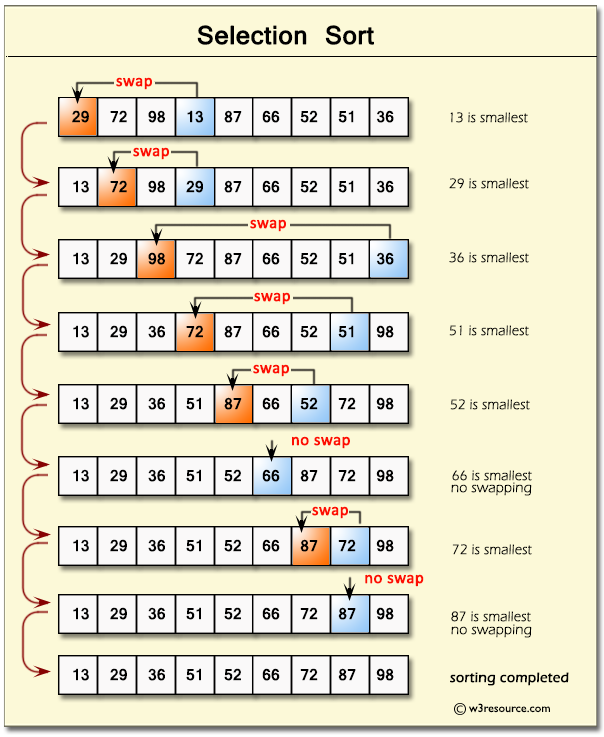

# Sorting

Different sorting methods in C++: https://leetcode.com/problems/sort-an-array/solutions/1401412/c-clean-code-solution-fastest-all-15-sorting-methods-detailed/

## Types of Sorting

1. [Selection sort](sorting.md#selection-sort) - take min. value to the right
2. [Quicksort](sorting.md#quicksort) - pivot sorting
3. [Patience sort](sorting.md#patience-sort) - pile of cards

### Selection Sort

Time: O(n^2) - best, average, worst, Space: O(1)

When iterating through each element in the array at position `i`, look to the right of `i` till the end of the array to find the minimum (let's call this `j`), then swap both elements if `i` is greater than that `j`.



```c
// a: array, n: size of array (as C is unable to determine its size)
void sort (int a[], int n) {
    int current, j, lowestindex, temp;
    for (current = 0; current < n-1; current++) {
        lowestindex = current;
        for (j = current+1; j < n; j++) {
            if (a[j] < a[lowestindex]) {
                lowestindex = j;
            }
        }
        if (lowestindex != current) {
            temp = a[current];
            a[current] = a[lowestindex];
            a[lowestindex] = temp;
        }
    }
}
```

### Quicksort

Time: O(nlog(n)) - best, average, O(n^2) - worst, Space: O(log(n))

.png>)

### Patience Sort

Refer to [Dynamic Programming](dp.md) > Longest Increasing Subsequence.
